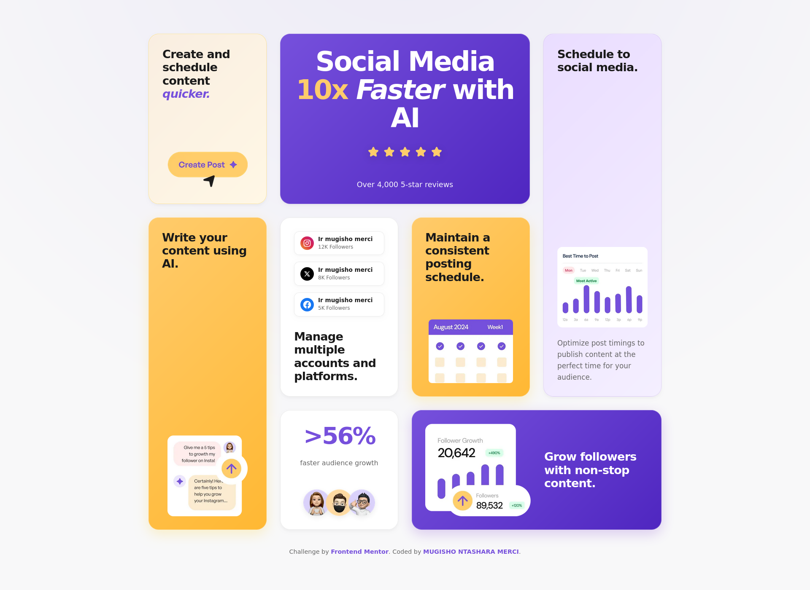

# Frontend Mentor - Bento grid solution

This is a solution to the [Bento grid challenge on Frontend Mentor](https://www.frontendmentor.io/challenges/bento-grid-RMydElrlOj). Frontend Mentor challenges help you improve your coding skills by building realistic projects.

## Table of contents

- [Frontend Mentor - Bento grid solution](#frontend-mentor---bento-grid-solution)
  - [Table of contents](#table-of-contents)
  - [Overview](#overview)
    - [The challenge](#the-challenge)
    - [Screenshot](#screenshot)
    - [Links](#links)
  - [My process](#my-process)
    - [Built with](#built-with)
    - [What I learned](#what-i-learned)
    - [Challenges](#challenges)
  - [Author](#author)

## Overview

### The challenge

Users should be able to:

- View the optimal layout for the interface depending on their device's screen size
- Navigate a clean and visually appealing Bento grid
- Experience smooth interactions and hover effects

### Screenshot

**Desktop Version**  

**Mobile Version**  

### Links

- Solution URL: [GitHub Repository](https://github.com/Mugisho-dev-metasploit/-Bento-grid-challenge-Frontend-Mentor-02)
- Live Site URL: [Live Site Project](https://mugisho-dev-metasploit.github.io/-Bento-grid-challenge-Frontend-Mentor-02/)

## My process

### Built with

- Semantic HTML5 markup
- CSS custom properties
- Flexbox
- CSS Grid
- Mobile-first workflow

### What I learned

- How to combine CSS Grid and Flexbox for a complex responsive layout
- Best practices for responsive design across multiple breakpoints
- Implementing hover and focus effects for cards
- Organizing and structuring a project for clarity and scalability

### Challenges

- Aligning cards of different sizes and spans in a complex grid layout
- Maintaining a consistent responsive behavior for all devices
- Optimizing images for both performance and visual quality

I overcame these challenges by testing layouts across multiple screen sizes, using CSS Grid for the main structure, Flexbox for card content alignment, and carefully adjusting spacing and ordering.

## Author

- Name - **Mugisho Ntashara**
- Frontend Mentor - [Mugisho Ntashara Merci](https://www.frontendmentor.io)
- Instagram - [@ir.mugisho_ntashara](https://www.instagram.com/ir.mugisho_ntashara/)
- Facebook - [Mugisho Merci](https://www.facebook.com/mugisho.merci.2025)
- Twitter/X - [@mugisho_merci](https://x.com/mugisho_merci?s=21)
